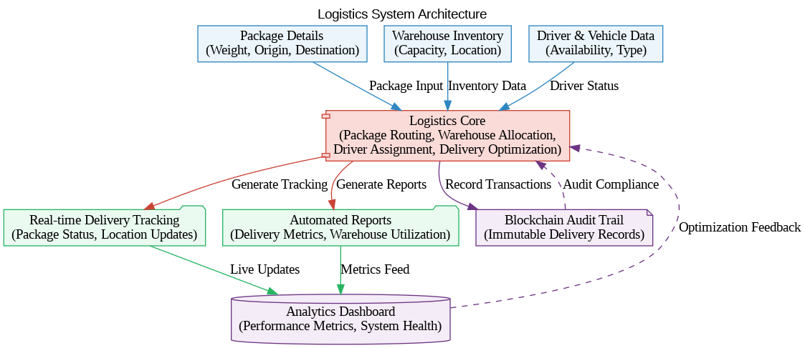

# Decentralized Logistics System


[](https://internetcomputer.org/)
[](https://sdk.dfinity.org/docs/language-guide/motoko.html)

A blockchain-based logistics management system built on the Internet Computer Protocol (ICP) featuring:

- 🚚 Package lifecycle tracking
- 🏭 Smart warehouse allocation
- 🚛 Dynamic route optimization
- 📊 Real-time delivery analytics

## Key Features

| Feature | Description | Tech Component |
|---------|-------------|----------------|
| Package Management | Track packages from origin to delivery | Motoko Canisters |
| Warehouse Automation | Smart capacity management | Stable Memory |
| Driver Coordination | Real-time driver routing | Actor Model |
| Route Optimization | AI-powered delivery pathing | Algorithmic Logic |
| Blockchain Audit | Immutable delivery records | ICP Blockchain |
# Logistics System

## System Architecture


## Features
- Real-time package tracking
- Automated route optimization
- Blockchain-based auditing
## Architecture Overview

```mermaid
erDiagram
    PACKAGE ||--o{ WAREHOUSE : stored_in
    PACKAGE ||--o{ ROUTE : assigned_to
    DRIVER ||--o{ ROUTE : completes
    WAREHOUSE {
        Nat id PK
        Text location
        Nat capacity
        [PackageId] storedPackages
    }
    PACKAGE {
        Nat id PK
        Float weight
        Text origin
        Text destination
        Enum status
        Enum priority
        ForeignKey warehouseId
        ForeignKey routeId
    }
    DRIVER {
        Nat id PK
        Text name
        Enum vehicleType
        Bool isAvailable
        [RouteId] completedRoutes
    }
    ROUTE {
        Nat id PK
        Text origin
        Text destination
        Float distanceKm
        ForeignKey driverId
    }